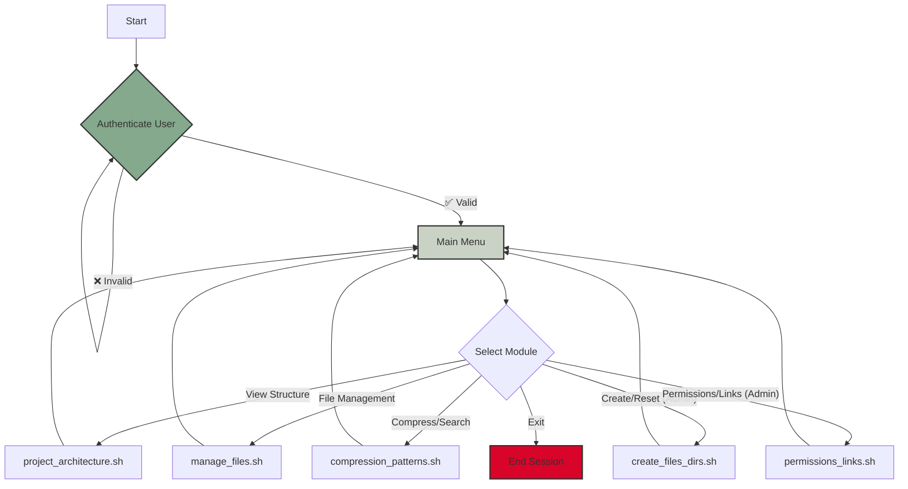
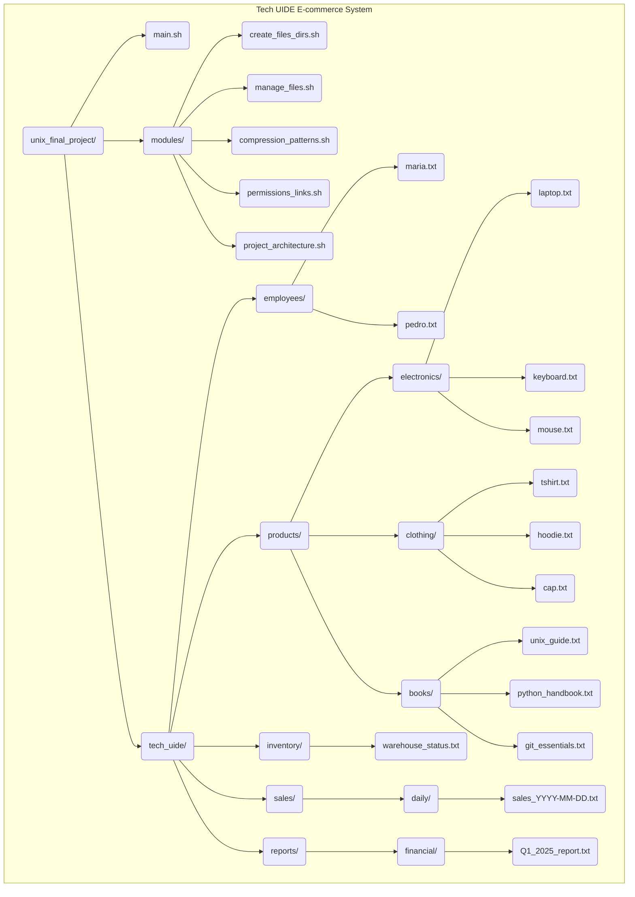

  
  <h1>TechUIDE UNIX Administration System</h1>
  
<strong>🚀 Your Interactive Sandbox for Mastering the UNIX Command Line 🚀</strong>

  

    
    
  

---

## 🎯 **Project Mission**

Imagine you're the new System Administrator for **TechUIDE**, a growing e-commerce company. Your mission is to manage the company's entire backend—from product catalogs to financial reports—using only a UNIX terminal.

This project isn't just a tutorial; it's a **fully interactive learning environment**. It transforms abstract commands into practical skills by giving you a real-world playground to explore, manage, and even break (and fix!).

---

## ✨ **Core Features & Learning Objectives**

This system is built around a set of core modules, each designed to teach you a fundamental aspect of UNIX administration:

-   🔐 **Role-Based Access Control**: Step into the shoes of a powerful `admin` or a standard `employee`. See firsthand how permissions change what you can see and do.

-   🗂️ **Realistic File & Directory Management**: Go beyond `touch` and `mkdir`. You'll be creating product files, updating inventory logs, archiving sales reports, and managing a logical business structure.

-   🛡️ **Permission & Security Simulation**: Learn the power and importance of `chmod`. Make scripts executable, protect sensitive financial data by making it read-only, and manage directory access.

-   🔎 **Powerful Search & Pattern Matching**: Use `grep` to instantly find products by name within files and `find` to locate any file or directory based on powerful patterns.

-   🗜️ **Data Compression & Archiving**: Practice using `tar`, `gzip`, and `zip` to bundle up old sales data for storage, a common task for any system administrator.

-   🔗 **Efficient Link Management**: Understand the practical difference between symbolic links (`ln -s`) for creating convenient shortcuts and hard links for creating file backups.

---

## 🚀 **Visualizing the System**

Click the dropdowns below to see a visual breakdown of the application's flow and the company structure you'll be managing.

  
<strong>Click to view ► 🗺️ Application Menu Flow</strong>

   
  <em>This diagram shows how a user navigates through the system, from login to the various admin modules.</em>
    

  
<strong>Click to view ► 🗂️ Simulated Company Directory</strong>

   
  <em>This diagram shows the complete file and folder hierarchy for the "TechUIDE" company. This is your digital workspace.</em>
    

---

## 🛠️ **Quick Start Guide**

Get up and running in under a minute with these three steps.

| Step | Command                                                                                                      | Description                                                                 |
| :--: | ------------------------------------------------------------------------------------------------------------ | --------------------------------------------------------------------------- |
|  1.  | `git clone https://github.com/mat1520/TechUIDE-UNIX-Admin-System.git` `cd TechUIDE-UNIX-Admin-System/unix_final_project` | Clone the repository and navigate into the project directory.               |
|  2.  | `chmod +x main.sh modules/*.sh`                                                                              | Make all the necessary scripts executable. This only needs to be done once. |
|  3.  | `./main.sh`                                                                                                  | Run the main application script to start the system.                        |

> **💡 Pro Tip:** After starting the system, log in as `admin` and select **Option 4** to create the initial file structure. Then, you're ready to explore!

---

## 👥 **User Roles & Permissions**

The system features two distinct user roles to simulate a real-world IT environment:

-   👑 **Administrator (`admin`)**: Possesses full control. Can create/delete files, manage permissions, and access all system modules.
-   👤 **Employee (`maria` & `pedro`)**: Represents standard users with restricted access. They can view data and perform basic file operations but are blocked from sensitive or destructive actions.

---

## ✍️ **Author**

This project was developed by **mat1520**.

  

 